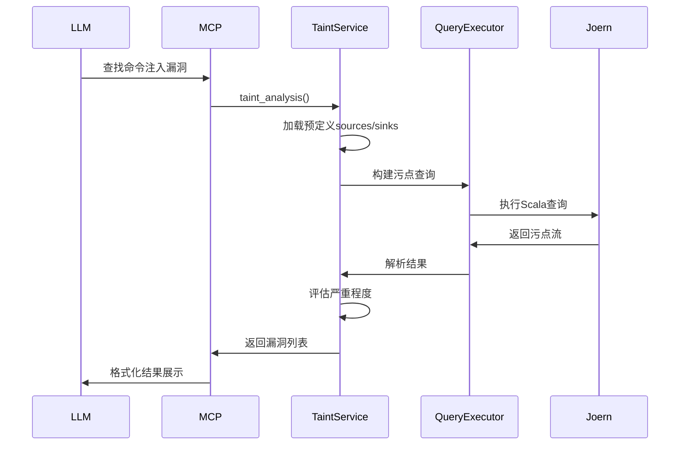

# Joern MCP Server 架构文档

## 目录

1. [系统概述](#系统概述)
2. [架构设计](#架构设计)
3. [核心组件](#核心组件)
4. [数据流](#数据流)
5. [交互流程](#交互流程)
6. [技术决策](#技术决策)
7. [扩展点](#扩展点)

## 系统概述

Joern MCP Server是一个桥接层，将Joern代码分析平台的强大功能通过MCP协议暴露给LLM使用。系统采用分层架构，确保各层职责清晰、易于维护和扩展。

### 系统目标

1. **易用性**: 让LLM能够简单直观地进行代码分析
2. **性能**: 高效处理大型代码库和复杂查询
3. **安全性**: 确保代码分析过程的安全可控
4. **可扩展性**: 支持新的分析类型和语言
5. **可靠性**: 稳定运行，优雅处理错误

## 架构设计

### 分层架构

```
┌─────────────────────────────────────────────────────────────┐
│                    LLM Application Layer                    │
│                  (Claude, GPT, Custom Apps)                 │
└────────────────────────┬────────────────────────────────────┘
                         │
                         │ MCP Protocol (stdio/HTTP)
                         │
┌────────────────────────┴────────────────────────────────────┐
│                    Presentation Layer                       │
│                                                              │
│  ┌────────────────────────────────────────────────────┐    │
│  │         FastMCP Application Framework              │    │
│  │                                                     │    │
│  │  ┌──────────────┐  ┌──────────────┐  ┌──────────┐│    │
│  │  │   Resources  │  │    Tools     │  │ Prompts  ││    │
│  │  └──────────────┘  └──────────────┘  └──────────┘│    │
│  └────────────────────────────────────────────────────┘    │
└─────────────────────────────────────────────────────────────┘
                         │
                         │ Internal API
                         │
┌─────────────────────────────────────────────────────────────┐
│                   Application Layer                         │
│                                                              │
│  ┌────────────────────────────────────────────────────┐    │
│  │              Analysis Services                      │    │
│  │                                                     │    │
│  │  ┌──────────┐ ┌───────────┐ ┌──────────────────┐ │    │
│  │  │Code Query│ │Call Graph │ │ Data Flow/Taint  │ │    │
│  │  │ Service  │ │  Service  │ │    Services      │ │    │
│  │  └──────────┘ └───────────┘ └──────────────────┘ │    │
│  └────────────────────────────────────────────────────┘    │
│                                                              │
│  ┌────────────────────────────────────────────────────┐    │
│  │           Cache & State Management                  │    │
│  │  - Query Result Cache                              │    │
│  │  - CPG State Manager                               │    │
│  │  - Session Manager                                 │    │
│  └────────────────────────────────────────────────────┘    │
└─────────────────────────────────────────────────────────────┘
                         │
                         │ Joern API
                         │
┌─────────────────────────────────────────────────────────────┐
│                   Integration Layer                         │
│                                                              │
│  ┌────────────────────────────────────────────────────┐    │
│  │            Joern Integration Module                 │    │
│  │                                                     │    │
│  │  ┌──────────┐ ┌────────────┐ ┌─────────────────┐ │    │
│  │  │  Joern   │ │    CPG     │ │     Query       │ │    │
│  │  │ Manager  │ │  Manager   │ │   Executor      │ │    │
│  │  └──────────┘ └────────────┘ └─────────────────┘ │    │
│  │                                                     │    │
│  │  ┌────────────────────────────────────────────┐   │    │
│  │  │         Result Parser & Formatter          │   │    │
│  │  └────────────────────────────────────────────┘   │    │
│  └────────────────────────────────────────────────────┘    │
└─────────────────────────────────────────────────────────────┘
                         │
                         │ Process/CLI
                         │
┌─────────────────────────────────────────────────────────────┐
│                  Infrastructure Layer                       │
│                                                              │
│  ┌────────────────────────────────────────────────────┐    │
│  │              Joern Platform                         │    │
│  │                                                     │    │
│  │  • joern CLI (REPL)                                │    │
│  │  • joern-parse (Code Parser)                       │    │
│  │  • joern-export (Exporter)                         │    │
│  │  • CPG Database (OverflowDB/FlatGraph)             │    │
│  └────────────────────────────────────────────────────┘    │
│                                                              │
│  ┌────────────────────────────────────────────────────┐    │
│  │           System Infrastructure                     │    │
│  │  • File System                                     │    │
│  │  • Process Management                              │    │
│  │  • Logging & Monitoring                            │    │
│  └────────────────────────────────────────────────────┘    │
└─────────────────────────────────────────────────────────────┘
```

## 核心组件

### 1. Presentation Layer（表示层）

#### 1.1 MCP Resources

**职责**: 提供只读资源访问接口

```python
class ProjectResource:
    """项目资源管理"""
    
    async def list_projects(self) -> List[ProjectInfo]:
        """列出所有已解析的项目"""
        
    async def get_project_info(self, project_id: str) -> ProjectInfo:
        """获取项目详细信息"""
        
    async def get_cpg_stats(self, project_id: str) -> CPGStats:
        """获取CPG统计信息"""
```

#### 1.2 MCP Tools

**职责**: 定义可执行的分析工具

```python
class AnalysisTools:
    """分析工具集合"""
    
    @tool()
    async def parse_project(self, source_path: str, language: str):
        """解析项目工具"""
        
    @tool()
    async def get_function_code(self, function_name: str):
        """获取函数代码工具"""
        
    @tool()
    async def track_dataflow(self, source: str, sink: str):
        """数据流追踪工具"""
```

#### 1.3 MCP Prompts

**职责**: 提供预定义的分析场景模板

```python
class AnalysisPrompts:
    """分析提示模板"""
    
    @prompt()
    def security_analysis(self, entry_point: str):
        """安全分析向导"""
        
    @prompt()
    def vulnerability_trace(self, vuln_type: str):
        """漏洞追踪向导"""
```

### 2. Application Layer（应用层）

#### 2.1 Analysis Services

**职责**: 实现具体的分析逻辑

##### Code Query Service

```python
class CodeQueryService:
    """代码查询服务"""
    
    def __init__(self, executor: QueryExecutor):
        self.executor = executor
        
    async def get_function(
        self, 
        name: str, 
        file_filter: Optional[str] = None
    ) -> List[FunctionInfo]:
        """获取函数信息"""
        query = self._build_function_query(name, file_filter)
        result = await self.executor.execute(query)
        return self._parse_functions(result)
        
    async def search_code(
        self, 
        pattern: str, 
        scope: str = "all"
    ) -> List[CodeMatch]:
        """搜索代码"""
```

##### Call Graph Service

```python
class CallGraphService:
    """调用图服务"""
    
    async def get_callers(
        self, 
        function: str, 
        depth: int = 1
    ) -> List[str]:
        """获取调用者"""
        
    async def get_callees(
        self, 
        function: str, 
        depth: int = 1
    ) -> List[str]:
        """获取被调用者"""
        
    async def build_call_graph(
        self, 
        entry_points: List[str], 
        max_depth: int = 5
    ) -> CallGraph:
        """构建调用图"""
```

##### Data Flow Service

```python
class DataFlowService:
    """数据流服务"""
    
    async def track_flow(
        self, 
        source: str, 
        sink: str,
        max_paths: int = 10
    ) -> List[DataFlowPath]:
        """追踪数据流"""
        
    async def analyze_variable_flow(
        self, 
        variable: str, 
        scope: str
    ) -> VariableFlow:
        """分析变量流向"""
```

##### Taint Analysis Service

```python
class TaintAnalysisService:
    """污点分析服务"""
    
    async def analyze_taint(
        self,
        sources: List[str],
        sinks: List[str],
        sanitizers: Optional[List[str]] = None
    ) -> List[TaintFlow]:
        """执行污点分析"""
        
    async def find_vulnerabilities(
        self,
        vuln_type: str = "all"
    ) -> List[Vulnerability]:
        """查找漏洞"""
        
    def _assess_severity(
        self, 
        flow: TaintFlow
    ) -> str:
        """评估严重程度"""
```

#### 2.2 Cache & State Management

##### Query Result Cache

```python
class QueryCache:
    """查询结果缓存"""
    
    def __init__(self, max_size: int = 1000, ttl: int = 3600):
        self.cache = LRUCache(maxsize=max_size)
        self.ttl = ttl
        
    async def get(self, key: str) -> Optional[Any]:
        """获取缓存"""
        
    async def set(self, key: str, value: Any):
        """设置缓存"""
        
    def invalidate(self, pattern: str):
        """失效缓存"""
```

##### CPG State Manager

```python
class CPGStateManager:
    """CPG状态管理"""
    
    def __init__(self):
        self.loaded_projects: Dict[str, CPGState] = {}
        self.active_project: Optional[str] = None
        
    async def load_project(self, project_id: str):
        """加载项目"""
        
    async def unload_project(self, project_id: str):
        """卸载项目"""
        
    def get_active_project(self) -> Optional[str]:
        """获取当前激活的项目"""
```

### 3. Integration Layer（集成层）

#### 3.1 Joern Manager

**职责**: 管理Joern的安装、启动和生命周期

```python
class JoernManager:
    """Joern管理器"""
    
    def __init__(self):
        self.joern_path: Optional[Path] = None
        self.version: Optional[str] = None
        self.workspace: Path = Path.home() / ".joern_mcp"
        
    def detect_joern(self) -> Path:
        """
        检测Joern安装
        优先级：
        1. JOERN_HOME环境变量
        2. PATH中的joern命令
        3. 默认安装路径
        """
        
    def ensure_joern(self) -> bool:
        """确保Joern可用"""
        
    def validate_installation(self) -> ValidationResult:
        """验证安装完整性"""
```

#### 3.2 CPG Manager

**职责**: 管理代码属性图的生成、加载和存储

```python
class CPGManager:
    """CPG管理器"""
    
    def __init__(self, joern_manager: JoernManager):
        self.joern_manager = joern_manager
        self.cpg_cache_dir = joern_manager.workspace / "cpg_cache"
        
    async def parse_project(
        self,
        source_path: Path,
        language: str = "auto",
        options: Optional[Dict] = None
    ) -> str:
        """
        解析项目生成CPG
        
        流程：
        1. 检测项目语言（如果为auto）
        2. 调用相应的joern-parse命令
        3. 等待解析完成
        4. 验证CPG完整性
        5. 返回项目ID
        """
        
    async def load_cpg(self, project_id: str) -> bool:
        """加载CPG到内存"""
        
    async def get_cpg_path(self, project_id: str) -> Path:
        """获取CPG存储路径"""
        
    async def delete_cpg(self, project_id: str):
        """删除CPG"""
```

#### 3.3 Query Executor

**职责**: 执行Joern查询并管理REPL进程

```python
class QueryExecutor:
    """查询执行器"""
    
    def __init__(self, cpg_manager: CPGManager):
        self.cpg_manager = cpg_manager
        self.repl_process: Optional[JoernREPL] = None
        self.query_templates = QueryTemplates()
        
    async def execute_query(
        self,
        query: str,
        timeout: int = 300,
        format: str = "json"
    ) -> Dict:
        """
        执行查询
        
        流程：
        1. 验证查询安全性
        2. 确保REPL进程运行
        3. 发送查询到REPL
        4. 等待结果
        5. 解析结果
        6. 返回格式化结果
        """
        
    async def start_repl(self, cpg_path: Path):
        """启动REPL进程"""
        
    async def stop_repl(self):
        """停止REPL进程"""
        
    async def health_check(self) -> bool:
        """健康检查"""
```

#### 3.4 Result Parser

**职责**: 解析Joern输出并转换为标准格式

```python
class ResultParser:
    """结果解析器"""
    
    def parse(
        self, 
        raw_output: str, 
        format: str = "json"
    ) -> Dict:
        """
        解析Joern输出
        
        处理：
        1. 清理REPL提示符
        2. 移除ANSI颜色代码
        3. 检测错误信息
        4. 解析JSON/其他格式
        5. 验证结果完整性
        """
        
    def clean_output(self, output: str) -> str:
        """清理输出"""
        
    def detect_error(self, output: str) -> Optional[str]:
        """检测错误"""
        
    def parse_json(self, output: str) -> Dict:
        """解析JSON"""
```

### 4. Infrastructure Layer（基础设施层）

#### 4.1 Logging System

```python
from loguru import logger

# 配置分层日志
logger.add(
    "logs/app_{time}.log",
    level="INFO",
    rotation="500 MB",
    retention="10 days"
)

logger.add(
    "logs/error_{time}.log",
    level="ERROR",
    rotation="100 MB",
    retention="30 days"
)

logger.add(
    "logs/debug_{time}.log",
    level="DEBUG",
    rotation="1 GB",
    retention="3 days"
)
```

#### 4.2 Monitoring & Metrics

```python
class MetricsCollector:
    """指标收集器"""
    
    def track_query(
        self, 
        query_type: str, 
        duration: float, 
        success: bool
    ):
        """记录查询指标"""
        
    def track_parse(
        self, 
        language: str, 
        size: int, 
        duration: float
    ):
        """记录解析指标"""
        
    def get_statistics(self) -> Dict:
        """获取统计信息"""
```

## 数据流

### 典型查询流程

```
┌────────┐
│  LLM   │ 1. 发起查询请求
└───┬────┘    "获取main函数的代码"
    │
    ↓ MCP Protocol
┌───────────────┐
│  MCP Server   │ 2. 接收并路由到对应Tool
└───────┬───────┘
        │
        ↓ Tool调用
┌────────────────┐
│ Analysis       │ 3. 调用分析服务
│ Service        │
└────────┬───────┘
         │
         ↓ 构建查询
┌─────────────────┐
│ Query           │ 4. 执行Joern查询
│ Executor        │
└────────┬────────┘
         │
         ↓ REPL交互
┌─────────────────┐
│ Joern REPL      │ 5. 查询CPG数据库
└────────┬────────┘
         │
         ↓ 返回结果
┌─────────────────┐
│ Result          │ 6. 解析结果
│ Parser          │
└────────┬────────┘
         │
         ↓ 格式化
┌─────────────────┐
│ Analysis        │ 7. 业务逻辑处理
│ Service         │
└────────┬────────┘
         │
         ↓ 返回
┌─────────────────┐
│ MCP Server      │ 8. 返回给LLM
└────────┬────────┘
         │
         ↓ MCP Response
    ┌────┴────┐
    │  LLM    │ 9. 接收并展示结果
    └─────────┘
```

### CPG生成流程

```
┌────────┐
│  User  │ 1. 请求解析项目
└───┬────┘    parse_project("/path/to/code")
    │
    ↓
┌───────────────┐
│ CPG Manager   │ 2. 检测语言和项目信息
└───────┬───────┘
        │
        ↓
┌───────────────┐
│ Language      │ 3. 识别项目语言
│ Detector      │    (C, Java, Python等)
└───────┬───────┘
        │
        ↓
┌───────────────┐
│ Joern Parse   │ 4. 调用joern-parse
│ Process       │    生成CPG
└───────┬───────┘
        │
        ↓ 监控进度
┌───────────────┐
│ CPG           │ 5. 保存CPG到缓存
│ Database      │
└───────┬───────┘
        │
        ↓
┌───────────────┐
│ CPG Manager   │ 6. 验证CPG完整性
└───────┬───────┘
        │
        ↓
┌───────────────┐
│ Project       │ 7. 注册项目元数据
│ Registry      │
└───────┬───────┘
        │
        ↓
    ┌────┴────┐
    │  User   │ 8. 返回项目ID
    └─────────┘
```

## 交互流程

### 安全分析场景



## 技术决策

### 1. 为什么选择进程间通信而不是JNI？

**决策**: 使用subprocess与Joern CLI交互

**理由**:
- ✅ 简化部署，不需要编译原生库
- ✅ 语言无关，Python和Scala解耦
- ✅ 进程隔离，Joern崩溃不影响MCP Server
- ✅ 易于调试和监控
- ❌ 性能开销相对较大（可通过缓存缓解）

### 2. 为什么使用异步架构？

**决策**: 基于asyncio的异步处理

**理由**:
- ✅ 支持高并发查询
- ✅ 非阻塞IO，提高资源利用率
- ✅ 与FastMCP框架契合
- ✅ 易于实现超时控制
- ❌ 代码复杂度增加

### 3. 为什么需要缓存层？

**决策**: 实现多级缓存策略

**理由**:
- ✅ 减少重复查询开销
- ✅ 提升响应速度
- ✅ 降低Joern负载
- ❌ 需要缓存失效策略
- ❌ 占用额外内存

### 4. 为什么使用模板化查询？

**决策**: 预定义Scala查询模板

**理由**:
- ✅ 降低LLM构建查询难度
- ✅ 确保查询安全性
- ✅ 优化查询性能
- ✅ 统一结果格式
- ❌ 灵活性受限（可通过自定义查询补充）

## 扩展点

### 1. 新增分析类型

实现新的分析服务：

```python
class CustomAnalysisService:
    """自定义分析服务"""
    
    async def analyze(self, params: Dict) -> Result:
        """实现分析逻辑"""
```

### 2. 新增语言支持

扩展语言检测和解析：

```python
class LanguageDetector:
    """语言检测器"""
    
    def detect(self, project_path: Path) -> str:
        """检测项目语言"""
        
    def get_parser_config(self, language: str) -> Dict:
        """获取解析器配置"""
```

### 3. 新增MCP工具

注册新的工具：

```python
@mcp.tool()
async def custom_tool(param1: str, param2: int) -> Dict:
    """自定义工具描述"""
    # 实现工具逻辑
```

### 4. 自定义查询模板

添加新的查询模板：

```python
class QueryTemplates:
    """查询模板库"""
    
    CUSTOM_QUERY = """
    // 自定义Scala查询
    cpg.custom.analysis().toJson
    """
```

## 总结

本架构设计遵循以下原则：

1. **分层解耦**: 各层职责清晰，便于维护和测试
2. **异步优先**: 充分利用Python异步特性，提高并发性能
3. **缓存优化**: 多级缓存策略，平衡性能和资源占用
4. **安全可控**: 查询验证、资源限制、路径白名单
5. **易于扩展**: 清晰的扩展点，支持新功能快速接入
6. **可观测性**: 完善的日志和监控，便于问题排查

---

**文档版本**: v1.0  
**最后更新**: 2025-11-26

