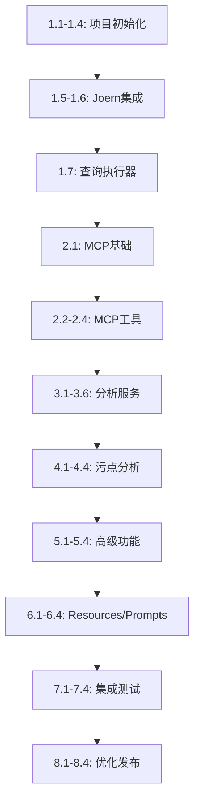

# Joern MCP Server 任务跟踪表

## 使用说明

- ✅ = 已完成
- 🚧 = 进行中
- ⏳ = 待开始
- ❌ = 已取消/跳过

## 第一周：基础设施搭建

### Day 1-2: 项目初始化

| 任务ID | 任务名称 | 预计时间 | 状态 | 负责人 | 完成日期 | 备注 |
|--------|---------|---------|------|-------|---------|------|
| 1.1 | 创建项目骨架 | 2h | ⏳ | - | - | 目录结构、__init__.py |
| 1.2 | 配置开发环境 | 2h | ⏳ | - | - | 虚拟环境、依赖、工具 |
| 1.3 | 实现配置管理 | 3h | ⏳ | - | - | Settings类、环境变量 |
| 1.4 | 实现日志系统 | 2h | ⏳ | - | - | loguru配置 |

**小计**: 9小时

**验收标准**:
```bash
pytest tests/test_config.py tests/test_utils/test_logger.py -v
python -c "from joern_mcp.config import settings; print(settings)"
```

---

### Day 3-4: Joern Server集成

| 任务ID | 任务名称 | 预计时间 | 状态 | 负责人 | 完成日期 | 备注 |
|--------|---------|---------|------|-------|---------|------|
| 1.5 | 实现JoernManager | 4h | ⏳ | - | - | 安装检测、版本管理 |
| 1.6 | 实现JoernServerManager | 6h | ⏳ | - | - | Server启动、停止 |

**小计**: 10小时

**验收标准**:
```bash
pytest tests/test_joern/ -v
python -c "from joern_mcp.joern.server import JoernServerManager; import asyncio; asyncio.run(JoernServerManager().start())"
```

---

### Day 5: 查询执行器

| 任务ID | 任务名称 | 预计时间 | 状态 | 负责人 | 完成日期 | 备注 |
|--------|---------|---------|------|-------|---------|------|
| 1.7 | 实现QueryExecutor | 4h | ⏳ | - | - | 查询执行、缓存、验证 |

**小计**: 4小时

**验收标准**:
```bash
pytest tests/test_joern/test_executor.py -v
```

---

## 第二周：MCP基础设施和项目管理工具

### Day 6-7: FastMCP集成

| 任务ID | 任务名称 | 预计时间 | 状态 | 负责人 | 完成日期 | 备注 |
|--------|---------|---------|------|-------|---------|------|
| 2.1 | MCP服务器基础 | 4h | ⏳ | - | - | FastMCP app、lifespan |
| 2.2 | 项目管理工具 - 解析 | 6h | ⏳ | - | - | parse_project、list_projects |

**小计**: 10小时

**验收标准**:
```bash
pytest tests/test_server.py tests/test_tools/test_project.py -v
python -m joern_mcp.server  # 能启动
```

---

### Day 8-9: 代码查询工具

| 任务ID | 任务名称 | 预计时间 | 状态 | 负责人 | 完成日期 | 备注 |
|--------|---------|---------|------|-------|---------|------|
| 2.3 | 函数查询工具 | 6h | ⏳ | - | - | get_function_code、list_functions |
| 2.4 | 查询模板系统 | 3h | ⏳ | - | - | QueryTemplates类 |

**小计**: 9小时

**验收标准**:
```bash
pytest tests/test_tools/test_query.py tests/test_joern/test_templates.py -v
```

---

## 第三周：分析服务实现

### Day 11-12: 调用图分析

| 任务ID | 任务名称 | 预计时间 | 状态 | 负责人 | 完成日期 | 备注 |
|--------|---------|---------|------|-------|---------|------|
| 3.1 | 调用图服务 | 4h | ⏳ | - | - | CallGraphService |
| 3.2 | 调用链工具 | 4h | ⏳ | - | - | get_callers、get_callees |
| 3.3 | 调用图工具 | 3h | ⏳ | - | - | get_call_graph |

**小计**: 11小时

---

### Day 13-14: 数据流分析

| 任务ID | 任务名称 | 预计时间 | 状态 | 负责人 | 完成日期 | 备注 |
|--------|---------|---------|------|-------|---------|------|
| 3.4 | 数据流服务 | 4h | ⏳ | - | - | DataFlowService |
| 3.5 | 数据流工具 | 4h | ⏳ | - | - | track_dataflow |
| 3.6 | 变量流分析 | 3h | ⏳ | - | - | analyze_variable_flow |

**小计**: 11小时

---

## 第四周：污点分析

### Day 15-17: 污点分析服务

| 任务ID | 任务名称 | 预计时间 | 状态 | 负责人 | 完成日期 | 备注 |
|--------|---------|---------|------|-------|---------|------|
| 4.1 | 污点分析服务 | 6h | ⏳ | - | - | TaintAnalysisService |
| 4.2 | 预定义规则 | 4h | ⏳ | - | - | 污点源、汇、漏洞类型 |
| 4.3 | 污点分析工具 | 4h | ⏳ | - | - | taint_analysis |
| 4.4 | 漏洞查找工具 | 3h | ⏳ | - | - | find_vulnerabilities |

**小计**: 17小时

---

## 第五周：高级功能

### Day 18-20: 控制流和批量操作

| 任务ID | 任务名称 | 预计时间 | 状态 | 负责人 | 完成日期 | 备注 |
|--------|---------|---------|------|-------|---------|------|
| 5.1 | 控制流服务 | 4h | ⏳ | - | - | ControlFlowService |
| 5.2 | CFG工具 | 3h | ⏳ | - | - | get_cfg |
| 5.3 | 批量查询 | 4h | ⏳ | - | - | batch_query |
| 5.4 | 结果导出 | 3h | ⏳ | - | - | export_results |

**小计**: 14小时

---

## 第六周：MCP Resources和Prompts

### Day 21-23: Resources和Prompts

| 任务ID | 任务名称 | 预计时间 | 状态 | 负责人 | 完成日期 | 备注 |
|--------|---------|---------|------|-------|---------|------|
| 6.1 | 项目资源 | 4h | ⏳ | - | - | ProjectResource |
| 6.2 | CPG资源 | 3h | ⏳ | - | - | CPGResource |
| 6.3 | 分析提示模板 | 4h | ⏳ | - | - | 安全分析、漏洞追踪等 |
| 6.4 | 使用指南 | 3h | ⏳ | - | - | 编写文档 |

**小计**: 14小时

---

## 第七周：集成测试

### Day 24-27: 测试和完善

| 任务ID | 任务名称 | 预计时间 | 状态 | 负责人 | 完成日期 | 备注 |
|--------|---------|---------|------|-------|---------|------|
| 7.1 | 端到端测试 | 6h | ⏳ | - | - | 完整分析流程 |
| 7.2 | 性能测试 | 4h | ⏳ | - | - | 查询性能、并发 |
| 7.3 | 错误处理完善 | 4h | ⏳ | - | - | 异常处理、重试 |
| 7.4 | 安全测试 | 3h | ⏳ | - | - | 查询注入等 |

**小计**: 17小时

---

## 第八周：优化和发布

### Day 28-30: 优化和文档

| 任务ID | 任务名称 | 预计时间 | 状态 | 负责人 | 完成日期 | 备注 |
|--------|---------|---------|------|-------|---------|------|
| 8.1 | 性能优化 | 4h | ⏳ | - | - | 查询优化、缓存调优 |
| 8.2 | API文档 | 4h | ⏳ | - | - | 所有工具的文档 |
| 8.3 | 使用示例 | 3h | ⏳ | - | - | 实际分析案例 |
| 8.4 | 发布准备 | 3h | ⏳ | - | - | 打包、版本号 |

**小计**: 14小时

---

## 工时统计

| 周次 | 预计工时 | 实际工时 | 完成率 | 状态 |
|------|---------|---------|--------|------|
| Week 1 | 23h | - | 0% | ⏳ |
| Week 2 | 19h | - | 0% | ⏳ |
| Week 3 | 22h | - | 0% | ⏳ |
| Week 4 | 17h | - | 0% | ⏳ |
| Week 5 | 14h | - | 0% | ⏳ |
| Week 6 | 14h | - | 0% | ⏳ |
| Week 7 | 17h | - | 0% | ⏳ |
| Week 8 | 14h | - | 0% | ⏳ |
| **总计** | **140h** | **-** | **0%** | **⏳** |

---

## 里程碑

| 里程碑 | 目标日期 | 状态 | 交付物 |
|--------|---------|------|--------|
| M1: 基础设施完成 | Week 1 结束 | ⏳ | Joern Server集成、查询执行器 |
| M2: MCP基础完成 | Week 2 结束 | ⏳ | MCP Server、基础工具 |
| M3: 分析功能完成 | Week 4 结束 | ⏳ | 调用图、数据流、污点分析 |
| M4: 功能完整 | Week 6 结束 | ⏳ | 所有MCP Tools、Resources、Prompts |
| M5: MVP发布 | Week 8 结束 | ⏳ | v0.1.0发布 |

---

## 风险跟踪

| 风险ID | 风险描述 | 可能性 | 影响 | 缓解措施 | 状态 |
|--------|---------|--------|------|---------|------|
| R1 | Joern Server不稳定 | 中 | 高 | 实现健康检查和自动重启 | 监控中 |
| R2 | 查询性能问题 | 高 | 中 | 实现缓存、查询优化 | 监控中 |
| R3 | MCP协议变更 | 低 | 高 | 使用稳定版本、关注更新 | 监控中 |
| R4 | 测试覆盖不足 | 中 | 中 | 每个功能都有测试 | 监控中 |

---

## 依赖关系



---

## 每日站会记录

### Week 1

#### Day 1 (周一)
- **计划**: 任务1.1-1.2
- **完成**: -
- **问题**: -
- **明天计划**: -

#### Day 2 (周二)
- **计划**: 任务1.3-1.4
- **完成**: -
- **问题**: -
- **明天计划**: -

_（继续记录...）_

---

## 测试覆盖率目标

| 模块 | 目标覆盖率 | 当前覆盖率 | 状态 |
|------|-----------|-----------|------|
| config.py | 90% | - | ⏳ |
| joern/manager.py | 85% | - | ⏳ |
| joern/server.py | 85% | - | ⏳ |
| joern/executor.py | 90% | - | ⏳ |
| tools/* | 80% | - | ⏳ |
| services/* | 85% | - | ⏳ |
| **整体** | **85%** | **-** | **⏳** |

---

## 代码审查检查清单

- [ ] 代码符合PEP 8规范（使用black格式化）
- [ ] 所有函数有类型注解
- [ ] 所有函数有docstring
- [ ] 单元测试覆盖主要逻辑
- [ ] 没有明显的性能问题
- [ ] 错误处理完善
- [ ] 日志记录充分
- [ ] 安全检查通过

---

## 发布检查清单

### v0.1.0 MVP

- [ ] 所有Week 1-8的任务完成
- [ ] 测试覆盖率 > 85%
- [ ] 所有测试通过
- [ ] 文档完整
- [ ] 示例代码运行正常
- [ ] 性能测试通过
- [ ] 安全审计通过
- [ ] 版本号更新
- [ ] CHANGELOG更新
- [ ] 发布说明编写

---

**使用提示**:
1. 每完成一个任务，更新状态为 ✅
2. 遇到问题在"备注"列记录
3. 每天更新"每日站会记录"
4. 每周五更新"工时统计"

**文档版本**: v1.0  
**最后更新**: 2025-11-26

