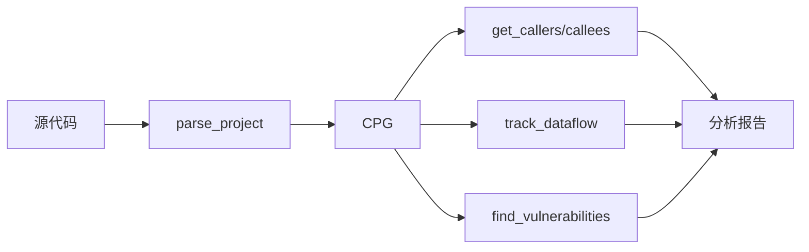

# 用户手册

本手册详细介绍 Joern MCP Server 的使用方法和最佳实践。

---

## 🎯 核心概念

### 什么是CPG？

**代码属性图 (Code Property Graph, CPG)** 是Joern的核心数据结构，它将代码的多种表示形式（AST、CFG、PDG等）合并为一个统一的图结构，支持跨语言的代码分析。

### 什么是MCP？

**模型上下文协议 (Model Context Protocol, MCP)** 是一种让AI模型与外部工具交互的协议。通过MCP，LLM可以直接调用Joern进行代码分析。

---

## 📂 工作流程

### 典型分析流程

```
1. 解析项目 → 2. 分析代码 → 3. 查找漏洞 → 4. 生成报告
```



---

## 🛠️ 功能详解

### 1. 项目管理

#### 解析项目

将源代码转换为CPG：

```python
# 基本用法
result = await parse_project("/path/to/project", "my-project")

# 指定语言
result = await parse_project(
    source_path="/path/to/java_project",
    project_name="java-app",
    language="java"  # 支持: c, java, javascript, python, kotlin, auto
)

# 检查结果
if result["success"]:
    print(f"项目 {result['project_name']} 解析成功")
else:
    print(f"解析失败: {result['error']}")
```

#### 管理项目

```python
# 列出所有项目
projects = await list_projects()
print(projects["workspace_info"])

# 删除项目
await delete_project("old-project")
```

---

### 2. 调用图分析

#### 获取函数调用者

查找哪些函数调用了目标函数：

```python
# 获取直接调用者
callers = await get_callers("vulnerable_function")

# 获取多层调用者
callers = await get_callers("vulnerable_function", depth=3)

# 处理结果
for caller in callers["callers"]:
    print(f"函数 {caller['name']} 在 {caller['filename']} 中调用了目标")
```

#### 获取被调用函数

查找目标函数调用了哪些函数：

```python
# 获取直接被调用者
callees = await get_callees("main")

# 获取多层被调用者
callees = await get_callees("main", depth=2)

# 处理结果
for callee in callees["callees"]:
    print(f"main 调用了 {callee['name']}")
```

#### 获取调用链

追踪完整的调用路径：

```python
# 向上追踪（谁调用了这个函数）
chain_up = await get_call_chain("dangerous_function", max_depth=5, direction="up")

# 向下追踪（这个函数调用了谁）
chain_down = await get_call_chain("main", max_depth=5, direction="down")

# 分析调用链
for func in chain_up["chain"]:
    print(f"  → {func['name']}")
```

#### 获取完整调用图

生成包含节点和边的调用图：

```python
# 获取双向调用图
graph = await get_call_graph("target_function", depth=2)

print(f"节点数: {graph['node_count']}")
print(f"边数: {graph['edge_count']}")

# 遍历节点
for node in graph["nodes"]:
    print(f"函数: {node['name']} ({node['type']})")

# 遍历边（调用关系）
for edge in graph["edges"]:
    print(f"{edge['from']} → {edge['to']}")
```

---

### 3. 数据流分析

#### 追踪数据流

从源方法到汇方法追踪数据流：

```python
# 追踪从gets到system的数据流
flows = await track_dataflow("gets", "system", max_flows=10)

if flows["count"] > 0:
    print(f"发现 {flows['count']} 条数据流路径")
    for flow in flows["flows"]:
        print(f"  源: {flow['source']['code']}")
        print(f"  汇: {flow['sink']['code']}")
        print(f"  路径长度: {flow['pathLength']}")
```

#### 分析变量流向

追踪特定变量的数据流：

```python
# 追踪user_input变量到所有危险函数
flow = await analyze_variable_flow("user_input", sink_method="system")

# 追踪变量到所有可能的目标
flow = await analyze_variable_flow("buffer")  # 不指定sink

for f in flow["flows"]:
    print(f"变量 {f['variable']} 流向 {f['sink']['method']}")
```

#### 查找数据依赖

分析函数内的数据依赖关系：

```python
# 查找main函数的所有数据依赖
deps = await find_data_dependencies("main")

# 查找特定变量的依赖
deps = await find_data_dependencies("main", variable_name="buf")

for dep in deps["dependencies"]:
    print(f"变量 {dep['variable']} 依赖于 {dep['source']}")
```

---

### 4. 漏洞检测

#### 自动检测漏洞

使用内置规则检测漏洞：

```python
# 检测所有漏洞
all_vulns = await find_vulnerabilities()

# 只检测严重漏洞
critical = await find_vulnerabilities(severity="CRITICAL")

# 使用特定规则
sql_injection = await find_vulnerabilities(rule_name="SQL Injection")

# 处理结果
print(f"发现 {all_vulns['total_count']} 个漏洞")
print(f"严重级别分布: {all_vulns['summary']}")

for vuln in all_vulns["vulnerabilities"]:
    print(f"[{vuln['severity']}] {vuln['vulnerability']}")
    print(f"  位置: {vuln['file']}:{vuln['line']}")
    print(f"  CWE: {vuln.get('cwe_id', 'N/A')}")
```

#### 自定义污点分析

检查特定的污点流：

```python
# 检查自定义的源-汇对
flows = await check_taint_flow(
    source_pattern="gets|scanf|fgets",  # 正则表达式
    sink_pattern="system|exec|popen",
    max_flows=20
)

for flow in flows["flows"]:
    print(f"污点从 {flow['source']['code']} 流向 {flow['sink']['code']}")
```

#### 查看漏洞规则

```python
# 列出所有规则
rules = await list_vulnerability_rules()
for rule in rules["rules"]:
    print(f"{rule['name']} ({rule['severity']}): {rule['description']}")

# 获取规则详情
detail = await get_rule_details("Command Injection")
print(f"源: {detail['rule']['sources']}")
print(f"汇: {detail['rule']['sinks']}")
```

---

### 5. 自定义查询

执行原生CPGQL查询：

```python
# 获取所有方法名
result = await execute_query("cpg.method.name.l")

# 查找特定模式的调用
result = await execute_query('cpg.call.name(".*alloc.*").l')

# 复杂查询
result = await execute_query("""
    cpg.method
       .name("main")
       .ast
       .isCall
       .name("strcpy")
       .argument
       .code
       .l
""")

# 使用format参数
result = await execute_query("cpg.method.dotAst.head", format="dot")
```

---

## 🎯 常见场景

### 场景1：C代码安全审计

```python
# 1. 解析C项目
await parse_project("/path/to/c_project", "audit-target", language="c")

# 2. 快速扫描所有漏洞
vulns = await find_vulnerabilities()
print(f"发现 {vulns['total_count']} 个潜在漏洞")

# 3. 重点检查严重漏洞
critical = await find_vulnerabilities(severity="CRITICAL")

# 4. 对每个漏洞追踪调用链
for vuln in critical["vulnerabilities"]:
    func_name = vuln.get("method", "unknown")
    chain = await get_call_chain(func_name, direction="up", max_depth=5)
    print(f"漏洞函数 {func_name} 的调用链: {chain['chain']}")
```

### 场景2：漏洞影响分析

```python
# 1. 找到漏洞函数
vuln_func = "vulnerable_handler"

# 2. 查找所有调用者
callers = await get_callers(vuln_func, depth=5)
print(f"有 {callers['count']} 个函数可能触发此漏洞")

# 3. 追踪入口点
for caller in callers["callers"]:
    if "main" in caller["name"] or "handler" in caller["name"]:
        print(f"发现入口点: {caller['name']}")
```

### 场景3：数据流审计

```python
# 1. 识别所有用户输入
user_inputs = ["gets", "scanf", "fgets", "read", "recv"]

# 2. 识别危险函数
dangerous_funcs = ["system", "exec", "strcpy", "sprintf", "eval"]

# 3. 追踪每条路径
for source in user_inputs:
    for sink in dangerous_funcs:
        flows = await track_dataflow(source, sink)
        if flows["count"] > 0:
            print(f"⚠️ 发现 {source} -> {sink} 的数据流!")
```

---

## 💡 最佳实践

### 1. 项目管理

- ✅ 为每个项目使用唯一名称
- ✅ 分析完成后删除不需要的项目
- ✅ 大型项目先分析核心模块

### 2. 性能优化

- ✅ 使用合理的`depth`参数（建议1-3）
- ✅ 限制`max_flows`避免结果过多
- ✅ 使用缓存减少重复查询

### 3. 漏洞分析

- ✅ 先用内置规则快速扫描
- ✅ 对发现的漏洞进行人工验证
- ✅ 使用调用链追踪确认影响范围

### 4. 自定义查询

- ✅ 先在Joern CLI中测试查询
- ✅ 使用`.l`获取列表结果
- ✅ 复杂查询分步执行

---

## ⚠️ 限制与注意事项

### 已知限制

1. **语言支持**: 主要支持C/C++, Java, JavaScript，其他语言支持有限
2. **项目大小**: 超大型项目（>1M行代码）可能需要额外内存
3. **并发查询**: 建议限制并发数在5以内

### 安全注意

1. **自定义查询**: 默认启用，可通过配置禁用
2. **认证**: 生产环境建议启用Joern Server认证
3. **超时**: 复杂查询可能需要较长时间

---

## 📚 进阶阅读

- [Joern文档](https://docs.joern.io/) - 深入了解CPGQL
- [API参考](./API_REFERENCE.md) - 所有工具的详细参数
- [示例项目](../examples/) - 实际漏洞检测案例

